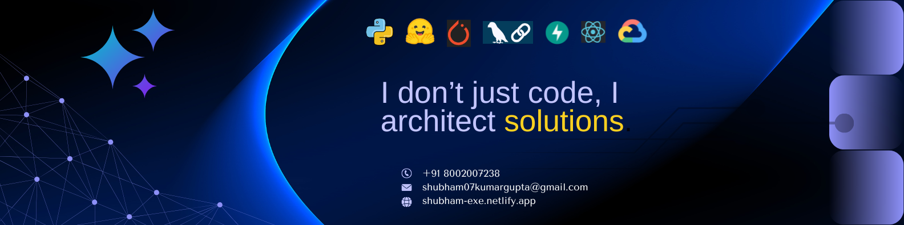

  

## 🔗 **CONNECT**

<a href="https://wa.me/918002007238?text=Hi%20Shubham!%20I%20came%20across%20your%20profile%20and%20would%20like%20to%20connect.%20Let's%20discuss!" target="_blank" rel="noopener noreferrer"></a>
<a href="https://www.linkedin.com/in/shubhamiitpatna" target="_blank" rel="noopener noreferrer"></a>
<a href="mailto:shubham07kumargupta@gmail.com" target="_blank" rel="noopener noreferrer"></a>
<a href="https://shubham-exe.netlify.app" target="_blank" rel="noopener noreferrer"></a>
<a href="https://drive.google.com/file/d/1P0PTNqO66nNPzrlRaa7aOvRHNPGx6HaQ/view" target="_blank" rel="noopener noreferrer"></a>

## 🏆 **HIGHLIGHTS**

- 🏆 **5X Hackathon Winner** - 100% Accuracy Achievement | Competitive AI excellence
- 🎓 **Academic Excellence** - CGPA: 9.2/10 @ IIT Patna
- 🚀 **15+ Real Projects** - Production-ready solutions deployed and scaling

**AI/ML Specialist | System Architect | Backend Beast | Full Stack Developer**

---

## 📈 **PROFESSIONAL EXPERIENCE**

### **AI ML Intern** @ Humantics
**April 2025 – Present** | Remote, India

- Built and deployed 3 AI-driven healthcare products in 6 months, with 2 scaling to 10,000+ premium users and achieving 95% retention through low friction experience
- Architected scalable Agentic AI systems, reducing API latency by 55% and improving system throughput by 60% in production environments
- Fine-tuned advanced medical vision models including MedGemma, U-Net, CXR Foundation Models, and YOLOv8 to enhance diagnostic accuracy and enable efficient real-time clinical integration

### **Freelance AI & Full Stack Developer**
**August 2025 – Present** | Remote, India

- Built **<a href="https://drishkul.com" target="_blank" rel="noopener noreferrer">Drishkul</a>** 🎓, an AI-powered career guidance platform delivering personalized reports, 2000+ career recommendations, RAG support, payments, coupons, referrals, and multi-role dashboards.
- Developed a full stack website for **<a href="https://rudranshmedia.netlify.app" target="_blank" rel="noopener noreferrer">RudranshMedia</a>** 🌐 to showcase content, featuring a secure 2FA enabled admin panel, SEO optimized architecture, and social media analytics.

---

💼 **Next role could be at your place** - Let's build something amazing together!

<a href="https://wa.me/918002007238?text=Hi%20Shubham!%20👋%0A%0AI%20came%20across%20your%20profile%20and%20I'm%20impressed%20by%20your%20work%20in%20AI%2FML%20and%20Full%20Stack%20Development.%20I'd%20love%20to%20discuss%20a%20potential%20collaboration%20or%20opportunity%20with%20you.%20🚀" target="_blank" rel="noopener noreferrer"></a>

---

## 🛠️ **TECH STACK**

| Category | Technologies |
|:--------:|:-------------|
| **🧠 AI/ML/DL** |              |
| **🤖 GenAI & NLP** |          |
| **👁️ Computer Vision** |          |
| **🔧 MLOps & Monitoring** |       |
| **⚙️ Backend & APIs** |          |
| **🗄️ Databases & Storage** |         |
| **☁️ Cloud & DevOps** |          |
| **🎨 Frontend** |          |
| **🛠️ Tools & Utilities** |          |

⚡ **Ready to code the future** - Let's create something extraordinary!

---

### 🔒 **Want to see more?**

Much of my best work is in **private repos** (production apps, client projects, and ongoing experiments). I’d love to connect and share more. Reach out and let’s see what we can build together.

<a href="https://wa.me/918002007238?text=Hi%20Shubham!%20👋%0A%0AI'd%20love%20to%20connect%20and%20learn%20more%20about%20your%20work.%20Let's%20discuss!%20🚀" target="_blank" rel="noopener noreferrer"></a>

